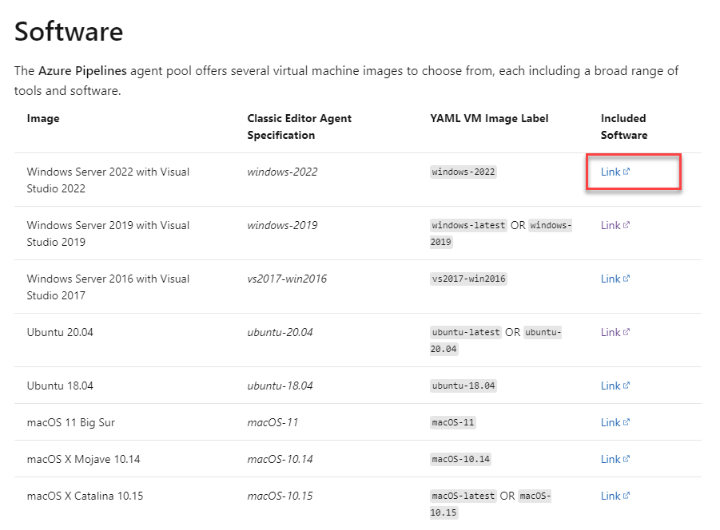

# Implement & Use a Self-hosted Docker Agent

[Run a self-hosted agent in Docker](https://learn.microsoft.com/en-us/azure/devops/pipelines/agents/docker?view=azure-devops)

## Demos

- Implement & Use a Self-hosted Docker Agent hosted on Azure Container Instances
- Test your Agents with a variety of workloads

### Implement & Use a Self-hosted Docker Agent hosted on Azure Container Instances

- [Self hosted Docker Linux Agent](./linux-agent)
- [Self hosted Docker Windows Agent](./win-agent)

[Run a self-hosted agent in Docker](https://learn.microsoft.com/en-us/azure/devops/pipelines/agents/docker?view=azure-devops)

[Authenticate with Azure Container Registry from Azure Container Instances](https://learn.microsoft.com/en-us/azure/container-registry/container-registry-auth-aci)

[Microsoft Hosted Agents Software Inventory](https://learn.microsoft.com/en-us/azure/devops/pipelines/agents/hosted?view=azure-devops&tabs=yaml) gives you a starting point for software installed on Azure-hosted-agents



To use your custom agent you could use:

```yaml
pool:
    name: selfhosted
```

### Test your Agents with a variety of workloads

#### Functional Test

Simple Agent Test `./agent-tests/test-agent.yml`:

```yaml
trigger:
    - main

pool:
    name: selfhosted

steps:
    - script: echo Hello, world!
      displayName: "Run a one-line script"

    - script: |
          echo Add other tasks to build, test, and deploy your project.
          echo See https://aka.ms/yaml
      displayName: "Run a multi-line script"
```

#### .NET Core Test

Test a .NET 5 Build from [MVC-DevOps](https://github.com/arambazamba/mvc-devops) using `./agent-tests/test-agent-net.yml`

To reference you custom pool in yaml use [pool](https://learn.microsoft.com/en-us/azure/devops/pipelines/agents/pools-queues?view=azure-devops&tabs=yaml%2Cbrowser#choosing-a-pool-and-agent-in-your-pipeline)

```
name: test-agent-net
trigger:
  branches:
    include:
      - master

pool:
    name: selfhosted
```

#### Microsoft 365 Stack Test

This sample is using `./agent-tests/test-agent-spfx.yml` [https://github.com/arambazamba/spfx-devops](https://github.com/arambazamba/spfx-devops/blob/main/az-pipelines/test-agent-spfx.yml)

Notice the line `RUN /installers/node.sh` in `dockerfile`. It installes Node 14.x, [Gulp](https://gulpjs.com/) that is used to build a [SharePoint Framework Webpart](https://learn.microsoft.com/en-us/sharepoint/dev/spfx/sharepoint-framework-overview) and the [CLI for Microsoft 365](https://pnp.github.io/cli-microsoft365/) that can be used to publish this WebPart later on. By preinstalling this software you can remove the steps from your `*.yaml` and speed up your DevOps.

```bash
curl -sL https://deb.nodesource.com/setup_14.x | sudo -E bash -
sudo apt install nodejs

echo "NODE Version:" && node --version
echo "NPM Version:" && npm --version

sudo npm i -g gulp
sudo npm i -g @pnp/cli-microsoft365
```
